# TapFindCase

## サービスURL

スマホ、タブレット、PCに対応しておりますので、お好きなデバイスでご使用ください。

https://tapfindcase.com

## サービス概要

このサービスは**iPhoneのケース探しのハードルを極力下げることを目的に、画面をタップするだけで気に入ったケースを見つけてECサイトまで辿り着ける**ように開発しました。コンテンツの充実と正確性を重視し、自力での情報収集、手入力はせず、デイリーベースでスクレイピングをして情報の更新をしています。

## このサービスに込めた想い

「ショッピングはしたいけれども、新しいアプリや機械を触るのが怖い」といった苦手意識を持つユーザーでも扱えるサービスがあったら良いなと思う出来事が過去にありました。私の両親や友人がそういったユーザーでしたので、このサービスを通じて苦手意識を少しでも払拭してもらいたい、そんな想いを込めて制作したのが本サービスとなります。

作るきっかけとなった失敗談

 

スマートフォンの使用割合がLINE8割、電話2割の私の家族が、自力でiPhoneケースを購入しようとしました。本来欲しかったのは「iPhone 13 Pro」のケースでしたが、「iPhone 13」のケースを購入(以下写真参照)してしまいました。
検索キーワードが足りなかったのか、おすすめに出てくる商品を見ていくうちに別のモデルの商品を案内されていたようです。
この失敗を機にさらにWEBサイトやスマホ操作に対して苦手意識を持ってしまいました。そこを何とかしてあげたいと思ったのが本サービスのきっかけです。

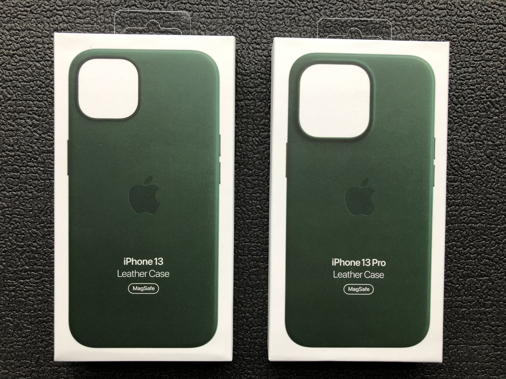

## こだわりポイント

- UI/UX
  - 一切文字入力をせずに操作するUI。
  - 毎日最新の最安値を反映することにより、気になって毎日でも訪れたくなるようにした。
  - 次の画面を開くボタンがわからないという、ユーザーからの要望を受けて無限スクロールを実装。
  - 無限スクロール時にスクロール位置を記録して、ブラウザバックしても同じ位置に戻れることでストレスの無い操作ができるようにした。
- フロントエンド
  - コンポーネントで拡張性を持たせたボタンを作成。
- バックエンド
  - Lambdaの容量制限を考慮し、不要なインストールは避けてサイズを調整。
- スクレイピング関連
  - マルチスレッドによる並列処理により、複数の画面を開いた状態でそれぞれがスクレイピングを実施。
  - マルチスレッドによる処理で、スレッド間によるサーバーリクエストは１秒以上あけて送るよう制御。
  - UserAgentの偽装。
  - 毎回異なるIPアドレスが割り当てられることを利用するためECSを採用。
  - 作業量に応じてタスクの数をLambdaで制御。
  - EventBridgeによるECSの起動。
  - S3にスクレイピングの作業結果を格納することにより、Lambdaで別の作業用のタスクが起動するよう制御。
  - 複数のタスクで1つのtxtファイルを取り合わないように、擬似ロックをかけるためタグに名前をつけて制御。
- CI/CD関連
  - Lambdaへのデプロイ時に環境の差異を無くすため、GitHub Actions上にAmazonlinux:2のコンテナを立ててデプロイ。
  - Frontend、Backend、スクレイピングコンテナ*3のどこが編集されたかに応じて、mainブランチにマージした際のアクションを分けた。
- 運用
  - RDSからDynamoDBに切り替えてサーバーレス化&低コスト化。
  - スクレイピングによるコンテンツの自動拡充。

## 使用画面紹介

### DEMO

|PC版|スマートフォン版|
|:-----------:|:-----------:|
|||

|説明|
|:---|
|商品を選択→選択したモデルの一覧→商品の詳細情報→お気に入り→閲覧履歴の順番で表示しています。|

### トップページ

|PC版|スマートフォン版|
|:-----------:|:-----------:|
||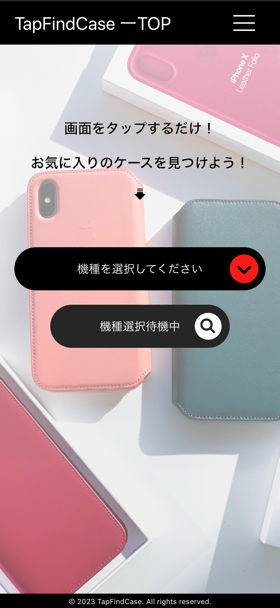|

|説明|
|:---|
|こちらの画面ではスクレイピングした結果からiPhoneのモデルを抽出して重複を削除してからプルダウン形式で表示するようにしています。機種は選択されるまで画面遷移が行われないようにUI側とバックエンド側で処理しています。|

### 製品一覧

|PC版|スマートフォン版|
|:-----------:|:-----------:|
||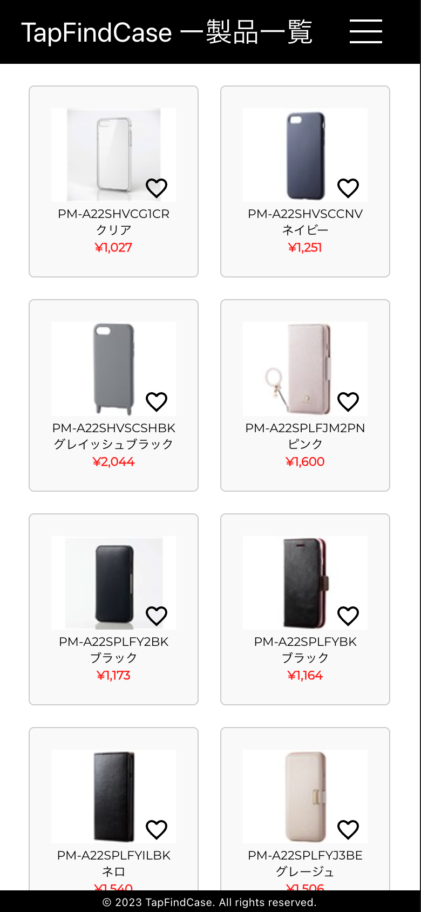|

|説明|
|:---|
|選択されたiPhoneのモデルに該当するケースを20件ずつ表示します。無限スクロールにしてあります。この画面上でもお気に入りの登録解除を行えます。|

### 商品詳細

|PC版|スマートフォン版|
|:-----------:|:-----------:|
||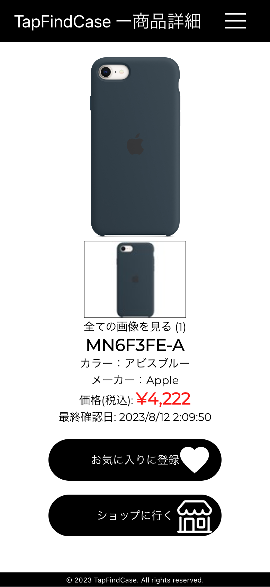|

|説明|
|:---|
|商品画像が複数あった場合は、サムネイル画像がカルーセル表示になり、選択された画像を拡大表示します。ここでもお気に入りの登録解除が行えます。この画面から直接商品を販売しているECサイトへ遷移することができます。|

### お気に入り

|PC版|スマートフォン版|
|:-----------:|:-----------:|
||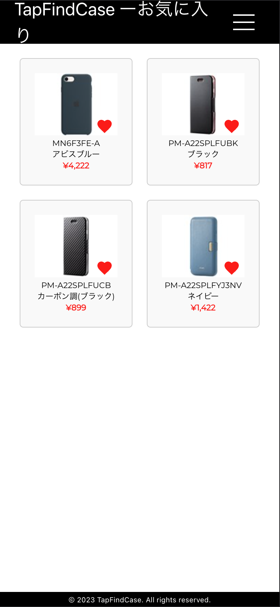|

|説明|
|:---|
|お気に入りに登録した商品一覧を表示します。20件以上あった場合は無限スクロールになります。|

### 閲覧履歴

|PC版|スマートフォン版|
|:-----------:|:-----------:|
||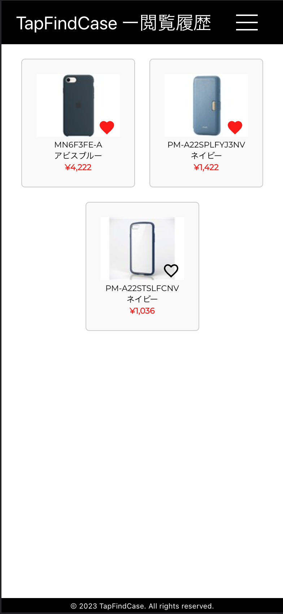|

|説明|
|:---|
|過去に商品詳細画面へ遷移したことのある商品の一覧を表示します。20件以上ある場合は無限スクロールになります。ソート順は商品詳細画面を開いた時間が新しい順に並んでいます。|

その他画面

### Cookieの保存許可を得る画面

|PC版|スマートフォン版|
|:-----------:|:-----------:|
||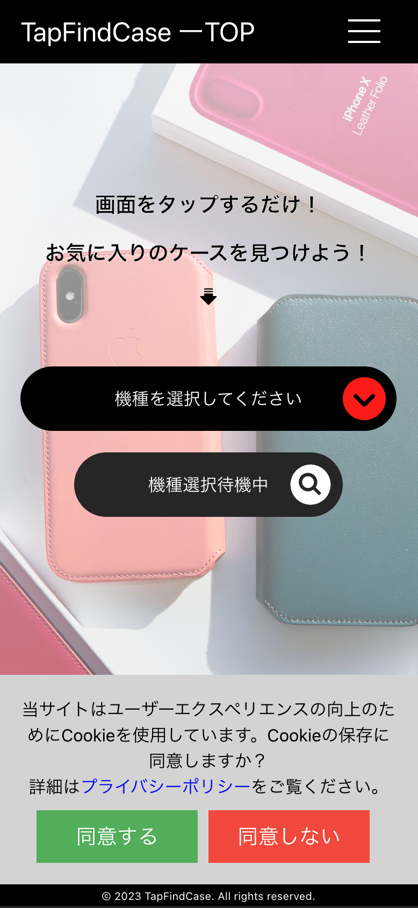|

|説明|
|:---|
|Cookieの保存許可を得る画面は、全ての画面で表示されます。どの画面で保存許可を出しても即座に反映されます。|

### モーダルによる利用規約の表示

|PC版|スマートフォン版|
|:-----------:|:-----------:|
|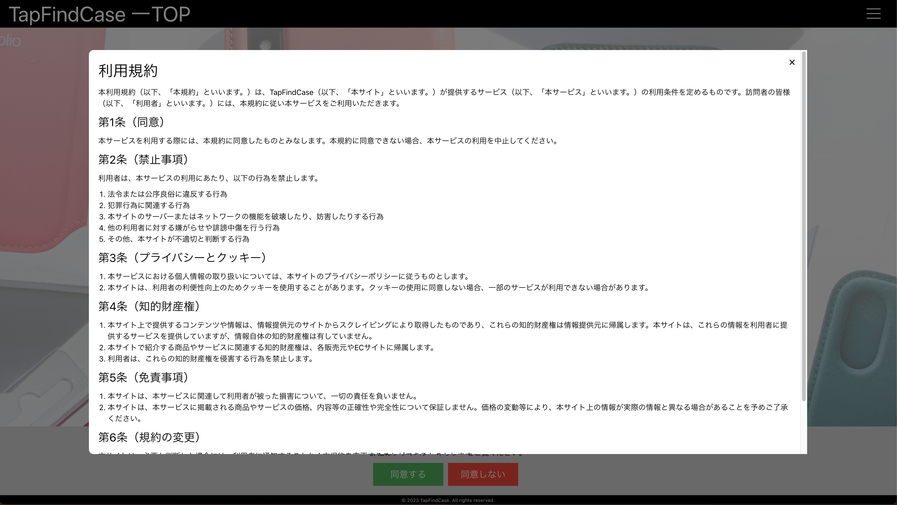|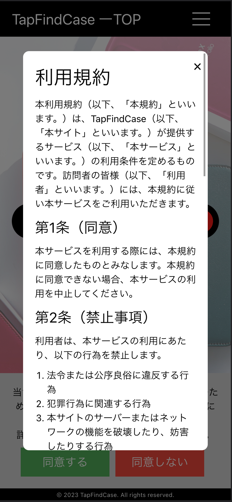|

|説明|
|:---|
|利用規約はもともと別画面で表示していましたが、ブラウザで別画面から元の画面へ戻ってこれないユーザーが居ましたのでモーダルでの表示に変更しました。モーダル画面外を押すことで画面を閉じることができます。|

### モーダルによるプライバシーポリシーの表示

|PC版|スマートフォン版|
|:-----------:|:-----------:|
|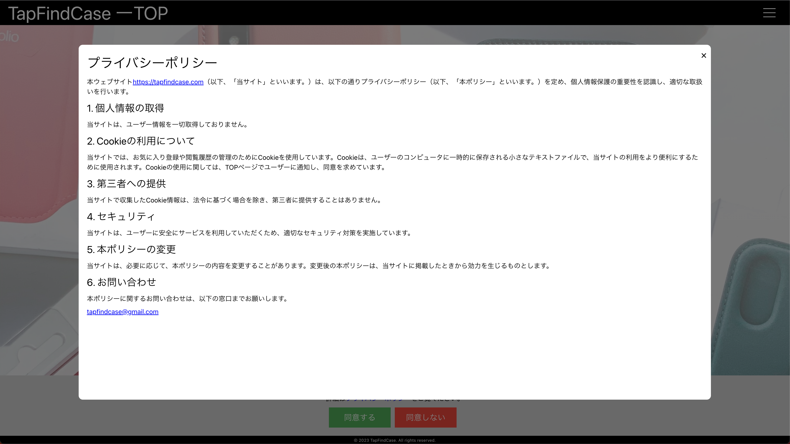|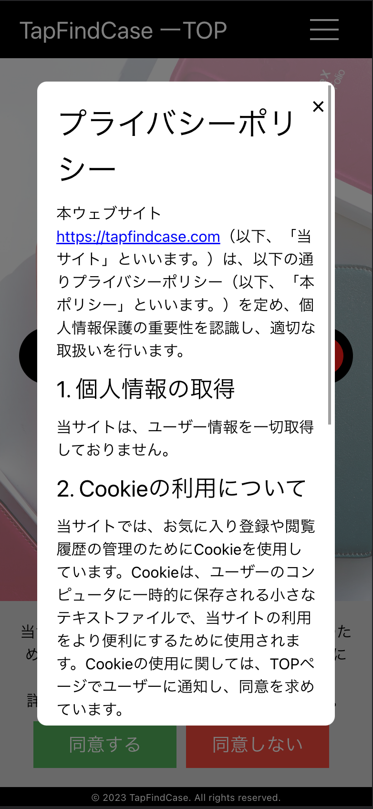|

|説明|
|:---|
|プライバシーポリシーも利用規約と同様、モーダルでの表示にしました。モーダル画面外を押すことで画面を閉じることができます。|

## インフラ構成図

## 使用技術

### Backend

- Ruby 3.2.2
- Ruby on Rails 7.0.6
  - RuboCop
  - RSpec
  - AWS-SDK for Ruby

### Frontend

- JavaScript ES6
- React 18
  - Router
  - Emotion
  - ResponsiveCarousel
  - Icons
  - Redux

### Infrastructure

- Docker
- AWS
  - Frontend
    - S3
    - CloudFront
  - Backend
    - APIGateway
    - Lambda
  - Server
    - DynamoDB
    - S3
  - Scraping
    - ECS
    - ECR
  - Secrets
    - Secrets Manager
    - System Manager
  - Events
    - EventBridge
    - Lambda
  - Monitoring
    - Route53
    - SNS

### CI/CD

- GitHub Actions
- Docker(Amazonlinux:2)
- Serverless Framework

### Others

- Git,GitHub
- AdobeXD

## 今後の予定

- UXの向上
  - ~~ロード中の表示をサークルインディケーターにする。~~
  - ~~サーバーレスによるコールドスタートで初期のレスポンスが悪いので改善。~~
  - 価格、色によるソート機能の追加。
  - 前日比で価格の変化がわかるようにする機能の追加。

- スクレイピング機能の拡張
  - ~~商品の詳細情報が載っているURLを別タブで開くようにしてコード内のsleepの数と秒数を減らす。~~
  - S3へのPutをトリガーに次のタスクが起動するようにしているのを、SQSによるキューを使った管理へ切り替える。
  - 4900点に取り扱い点数を増やす(現在906点)。最終目標は約33000点。
