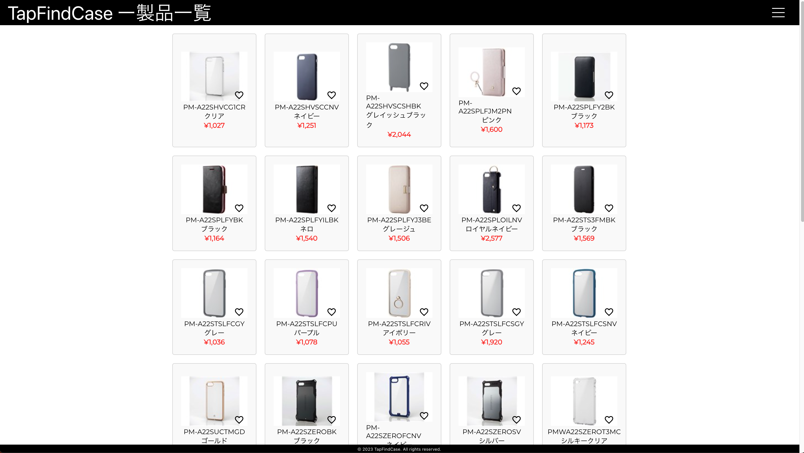
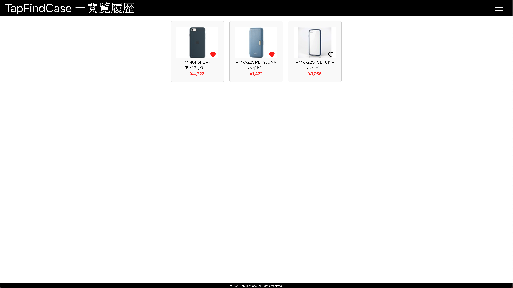

# TapFindCase

## サービスURL

スマホとPCどちらにも対応しておりますので、お好きなデバイスでご使用ください。

https://tapfindcase.com

## サービス概要

このサービスは**iPhoneのケース探しのハードルを極力下げることを目的に、画面をタップするだけで気に入ったケースを見つけてECサイトまで辿り着ける**ように開発しました。コンテンツの充実と正確性を重視し、自力での情報収集、手入力はせず、デイリーベースでスクレイピングして情報の更新をしています。

## このサービスに込めた想い

「新しいアプリや機械を触るのが怖い」といった感情を抱いてしまう、苦手意識を持った人でも扱えるサービスがあったら良いなと思う出来事が過去にありました。私の両親や友人がそういったユーザーでしたので、何としてでもこのサービスを通じて苦手意識を少しでも克服できるお手伝いや成功体験を積んでほしい。そんな想いを込めて制作したのが本サービスとなります。

作るきっかけとなった失敗談

 

スマートフォンの使用割合がLINE8割、電話2割の私の家族が、自力でiPhoneケースを購入しようとしました。本来欲しかったのは「iPhone 13 Pro」のケースでしたが、「iPhone 13」のケースを購入(以下写真参照)してしまいました。
検索キーワードが足りなかったのか、おすすめに出てくる商品を見ていくうちに別のモデルの商品を案内されていたようです。この失敗を機にさらにWEBサイトやスマホ操作に対して苦手意識を持ってしまいました。そこを何とかしてあげたいと思ったのが本サービスのきっかけです。

## こだわりポイント/がんばりポイント

- UI/UX
  - 一切文字入力をせずに操作するUI。
  - ページを切り替える場所がわからないという要望を受けて無限スクロールを実装。
- フロントエンド
  - コンポーネントで拡張性を持たせたボタンを作成。
- バックエンド
  - Lambdaの容量制限を考慮し、不要なインストールは避けてサイズを調整。
- スクレイピング関連
  1. 夜の2時に起動させ、商品の詳細画面のURLをスクレイピングするコンテナが立ち上がり、スクレイピング結果を40件ずつに分けてtxtファイルとしてS3に保存。
  2. S3のPutアクションをトリガーにLambdaを起動させ、商品詳細URLを取得するコンテナを起動させ、S3から取得する。
  3. 複数のコンテナで1つのtxtファイルを取り合わないように、擬似ロックをかけるためタグに名前をつけて制御。
  4. 商品詳細情報をtxtファイル、imageとthumbnailを分けて取得してそれぞれS3に保存。
  5. S3のPutアクションをトリガーにLambdaを起動させ、DynamoDBに保存するための処理をするコンテナを起動させる。
- CI/CD関連
  - Lambdaへのデプロイ時に環境を近付けるため、GitHub Actions上にAmazonlinux:2のコンテナを立ててデプロイ。
  - Frontend、Backend、スクレイピングコンテナ*3のどこが編集されたかに応じて、mainにマージした際のアクションを分けた。
- 運用
  - Aurora Serverless V2からDynamoDBに切り替えてサーバーレス化&低コスト化。
  - スクレイピングによるコンテンツの自動拡充。

## 使用画面紹介

### DEMO

|PC版|スマートフォン版|
|:-----------:|:-----------:|
|||

|説明|
|:---|
|商品を選択→選択したモデルの一覧→商品の詳細情報→お気に入り→閲覧履歴の順番で表示しています。|

### トップページ

|PC版|スマートフォン版|
|:-----------:|:-----------:|
|||

|説明|
|:---|
|こちらの画面ではスクレイピングした結果からiPhoneのモデルを抽出して重複を削除してからプルダウン形式で表示するようにしています。機種は選択されるまで画面遷移が行われないようにUI側とバックエンド側で処理しています。|

### 製品一覧

|PC版|スマートフォン版|
|:-----------:|:-----------:|
|||

|説明|
|:---|
|選択されたiPhoneのモデルに該当するケースを20件ずつ表示します。無限スクロールにしてあります。この画面上でもお気に入りの登録解除を行えます。|

### 商品詳細

|PC版|スマートフォン版|
|:-----------:|:-----------:|
|||

|説明|
|:---|
|商品画像が複数あった場合は、サムネイル画像がカルーセル表示になり、選択された画像を拡大表示します。ここでもお気に入りの登録解除が行えます。この画面から直接商品を販売しているECサイトへ遷移することができます。|

### お気に入り

|PC版|スマートフォン版|
|:-----------:|:-----------:|
|||

|説明|
|:---|
|お気に入りに登録した商品一覧を表示します。20件以上あった場合は無限スクロールになります。|

### 閲覧履歴

|PC版|スマートフォン版|
|:-----------:|:-----------:|
|||

|説明|
|:---|
|過去に商品詳細画面へ遷移したことのある商品の一覧を表示します。20件以上ある場合は無限スクロールになります。ソート順は商品詳細画面を開いた時間が新しい順に並んでいます。|

## インフラ構成図

## 使用技術

### Backend

- Ruby 3.2.2
- Ruby on Rails 7.0.6
  - RuboCop
  - RSpec
  - AWS-SDK for Ruby

### Frontend

- JavaScript ES6
- React 18
  - Router
  - Emotion
  - ResponsiveCarousel
  - Icons
  - Redux

### Infrastructure

- Docker
- AWS
  - Frontend
    - S3
    - CloudFront
  - Backend
    - APIGateway
    - Lambda
  - Server
    - DynamoDB
    - S3
  - Scraping
    - ECS
    - ECR
  - Secrets
    - Secrets Manager
    - System Manager
  - Events
    - EventBridge
    - Lambda
  - Monitoring
    - Route53
    - SNS

### CI/CD

- GitHub Actions
- Docker(Amazonlinux:2)
- Serverless Framework

### Others

- Git,GitHub
- AdobeXD

## 今後の予定

- UXの向上
  - ロード中の表示をサークルインディケーターにする。
  - サーバーレスによるコールドスタートで初期のレスポンスが悪いので改善。
  - 価格、色によるソート機能の追加。

- スクレイピング機能の拡張
  - S3へのPutをトリガーに次のタスクが起動するようにしているのを、SQSによるキューを使った管理へ切り替える。
  - 商品の詳細情報が載っているURLを別タブで開くようにしてコード内のsleepの数と秒数を減らす。
  - 4900点に取り扱い点数を増やす(現在906点)。最終目標は約33000点。
