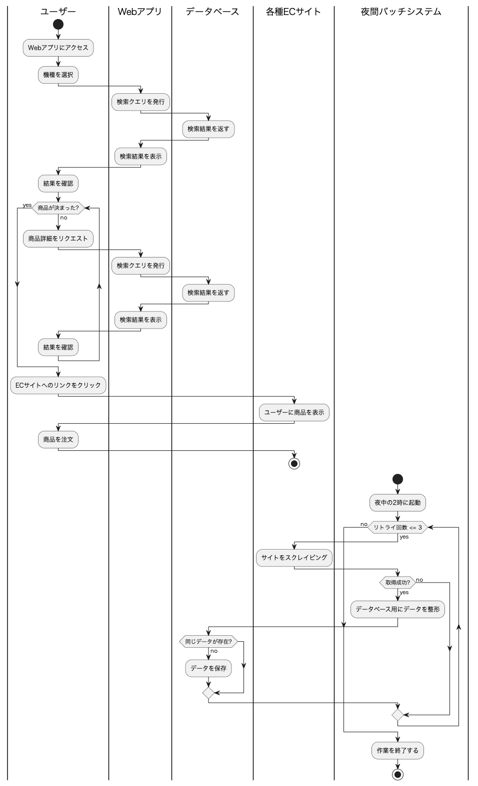
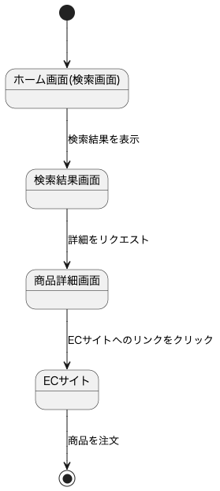

# 設計

## ステップ1

1. 業務フロー

2. 画面遷移図

3. ワイヤーフレーム

<a href="https://xd.adobe.com/view/1d001441-66de-4edf-b514-529cb98e2cef-4853/">https://xd.adobe.com/view/</a>

## ステップ2(テーブル定義書)

**productsテーブル**

|カラム名|データ型|NULL|キー|初期値|AUTO INCREMENT|
|-------|--------|----|---|-----|--------------|
|id|BIGINT|NO|PRIMARY|NULL|YES|
|name|VARCHAR(255)|NO||NULL|NO|
|maker|VARCHAR(255)|NO||NULL|NO|
|price|DECIMAL(10,2)|YES||NULL|NO|
|thumbnail_url|VARCHAR(255)|NO|UNIQUE|NULL|NO|
|image_url|VARCHAR(255)|NO|UNIQUE|NULL|NO|
|ec_site_url|VARCHAR(255)|NO|UNIQUE|NULL|NO|
|checked_at|TIMESTAMP|NO||CURRENT_TIMESTAMP|NO|

**modelsテーブル**

|カラム名|データ型|NULL|キー|初期値|AUTO INCREMENT|
|-------|--------|----|---|-----|--------------|
|id|BIGINT|NO|PRIMARY|NULL|YES|
|model|CHAR(30)|NO||NULL|NO|

**product_modelsテーブル**

|カラム名|データ型|NULL|キー|初期値|AUTO INCREMENT|
|-------|--------|----|---|-----|--------------|
|id|BIGINT|NO|PRIMARY|NULL|YES|
|product_id|BIGINT|NO|FOREIGN KEY|NULL|NO|
|model_id|BIGINT|NO|FOREIGN KEY|NULL|NO|

**usersテーブル**

|カラム名|データ型|NULL|キー|初期値|AUTO INCREMENT|
|-------|--------|----|---|-----|--------------|
|id|BIGINT|NO|PRIMARY|NULL|YES|
|cookie_id|VARCHAR(255)|NO|UNIQUE|NULL|NO|

**favoritesテーブル**

|カラム名|データ型|NULL|キー|初期値|AUTO INCREMENT|
|-------|--------|----|---|-----|--------------|
|id|BIGINT|NO|PRIMARY|NULL|YES|
|user_id|BIGINT|NO|FOREIGN KEY|NULL|NO|
|product_id|BIGINT|NO|FOREIGN KEY|NULL|NO|

**historyテーブル**

|カラム名|データ型|NULL|キー|初期値|AUTO INCREMENT|
|-------|--------|----|---|-----|--------------|
|id|BIGINT|NO|PRIMARY|NULL|YES|
|user_id|BIGINT|NO|FOREIGN KEY|NULL|NO|
|product_id|BIGINT|NO|FOREIGN KEY|NULL|NO|
|viewed_at|DATETIME|NO||NULL|NO|

## ステップ3(システム構成図)

- NoSQLから変更中

