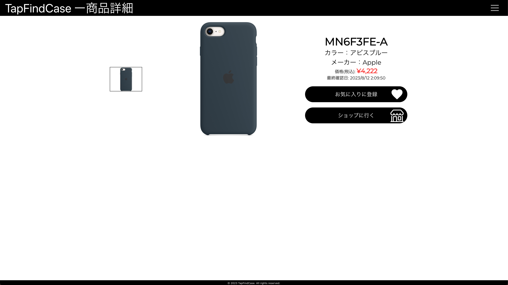

# TapFindCase

## サービスURL

スマホとPCどちらにも対応しておりますので、お好きなデバイスでご使用ください。

https://tapfindcase.com

## サービス概要

このサービスはiPhoneのケース探しのハードルを極力下げることを目的に、画面をタップするだけで気に入ったケースを見つけてECサイトまで辿り着けるように開発しました。コンテンツの充実と正確性を重視し、自力での情報収集、手入力はせず、デイリーベースでスクレイピングして情報の更新をしています。

## このサービスに込めた想い

「新しいアプリや機械を触るのが怖い」といった感情を抱いてしまう、苦手意識を持った人でも扱えるサービスがあったら良いなと考えることがありました。私の両親や友人がそういったユーザーでした。そういった人たちが、このサービスを通じて苦手意識を少しでも克服できるお手伝いや成功体験を積んでほしい。そんな想いを込めて制作したのが本サービスとなります。

## こだわりポイント

1. 一切文字入力をせずに操作するUI。
2. サーバーレス化。
3. スクレイピングによるコンテンツの自動拡充。
4. CI/CDでコンテナを使用し本番環境に近付けた。
5. 

## 使用画面紹介

### DEMO

|PC版|スマートフォン版|
|:-----------|:-----------|
|||

### トップページ

|PC版|スマートフォン版|
|:-----------|:-----------|
|||

### 製品一覧

|PC版|スマートフォン版|
|:-----------|:-----------|
|||

### 商品詳細

|PC版|スマートフォン版|
|:-----------|:-----------|
|||

### お気に入り

|PC版|スマートフォン版|
|:-----------|:-----------|
|||

### 閲覧履歴

|PC版|スマートフォン版|
|:-----------|:-----------|
|||

## インフラ構成図

## 使用技術

### Backend

- Ruby 3.2.2
- Ruby on Rails 7.0.6
  - RuboCop
  - RSpec
  - AWS-SDK for Ruby

### Frontend

- JavaScript ES6
- React 18
  - Router
  - Emotion
  - ResponsiveCarousel
  - Icons
  - Redux

### Infrastructure

- AWS
  - Frontend
    - S3
    - CloudFront
  - Backend
    - APIGateway
    - Lambda
  - Server
    - DynamoDB
    - S3
  - Scraping
    - ECS
    - ECR
  - Secrets
    - Secrets Manager
    - System Manager
  - Events
    - EventBridge
    - Lambda
  - Monitoring
    - Route53
    - SNS

### CI/CD

- GitHub Actions
- Docker(Amazonlinux:2)
- Serverless Framework

### Others

- Git,GitHub
- AdobeXD

## 今後の予定

- UXの向上
  - サーバーレスによるコールドスタートで初期のレスポンスが悪いので改善。
  - 価格、色によるソート機能の追加。

- スクレイピング機能の拡張
  - S3へのPutをトリガーに次のタスクが起動するようにしているのを、SQSによるキューを使った管理へ切り替える。
  - 商品の詳細情報が載っているURLを別タブで開くようにしてコード内のsleepの数と秒数を減らす。
  - 4900点に取り扱い点数を増やす(現在906点)。最終目標は約33000点。
